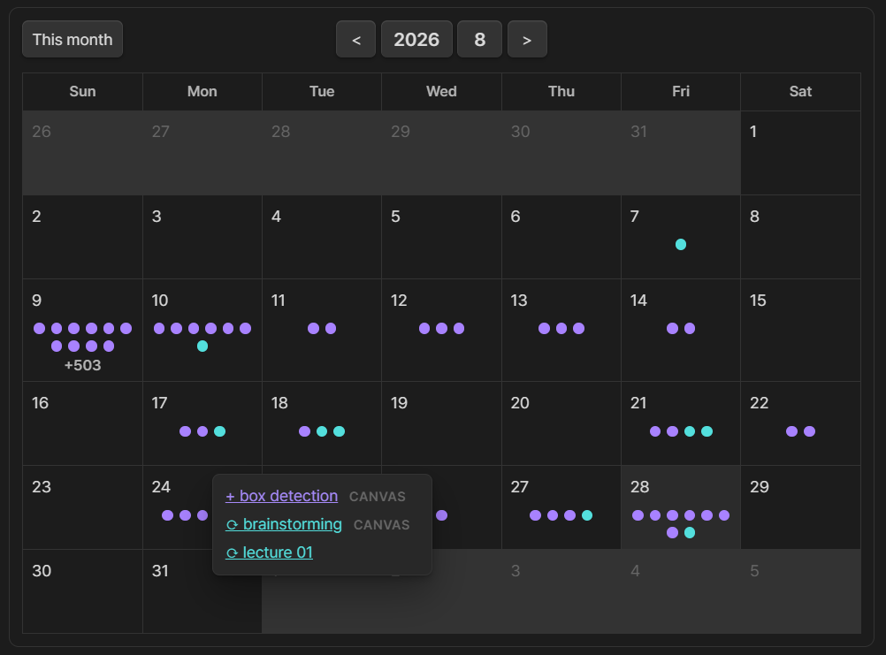

# History

[English](./README.md) | [한국어](./README_KO.md) | [简体中文](./README_CN.md)



History는 노트와 캔버스의 생성·수정 날짜를 자동으로 기록하고 상호작용할 수 있는 달력에 보여주는 Obsidian 플러그인입니다. 보라색 점은 생성일, 하늘색 점은 수정일을 나타내며, 날짜에 마우스를 올리면 해당 파일을 모두 확인할 수 있습니다. 달력이 좁아지면 점 대신 색상별 개수를 간결하게 표시합니다.

## 사용법

1. 플러그인을 활성화하면 Markdown 노트의 `history` 프론트매터와 Canvas 파일 최상위의 `history` 배열을 자동으로 관리합니다.
2. 달력을 표시할 노트에 다음 코드 블록을 추가하세요.

````markdown
```history
```
````
3. 같은 달력을 우측 사이드바에 두려면 명령 팔레트에서 **History: 히스토리 달력 열기**를 실행하세요.

노트에 삽입한 달력은 최대 너비를 지정할 수 있으며, 버튼과 높이도 닮음비에 맞춰 같이 줄어듭니다. 편집 모드와 읽기 모드 모두에서 달력에 마우스를 올린 뒤 우하단 핸들을 드래그하면 새 `max-width`가 코드 블록에 저장됩니다. 사이드바도 패널 너비가 바뀐 때 같은 닮음비 로직을 사용하지만 핸들은 표시하지 않습니다.

````markdown
```history
max-width: 502
mode: number
align: center
ratio: 1.2
font-size: 1.0
marker-size: 1.2
```
````

`mode: number`는 너비와 관계없이 점 대신 보라색·민트색 노트 개수를 항상 표시합니다. 점 모드는 첫째·둘째 줄에 각각 6개를 가운데 정렬한 뒤 셋째 줄에 초과분 `+N`을 가운데 표시합니다. 생략하면 자동으로 표시하며, `align`은 `left`, `center`, `right` 중 하나를 사용합니다. 본문 달력은 `max-width: 502`가 기본이고, `ratio`는 셀의 가로 ÷ 세로 비율으로 기본값은 `1.2`입니다. `font-size`는 헤더·요일·날짜 글자와 버튼 크기를 `0.5–2.0` 범위에서 조정하며 기본값은 `1.0`입니다. `marker-size`는 점·개수·`+N`을 독립적으로 `0.5–2.0` 범위에서 조정하며 기본값은 `1.2`입니다. 너비에 따른 축소는 이후에도 함께 적용됩니다. 사이드바 기본값은 숫자 마커, 셀 비율 `0.6`, 글자 배율 `2.0`(최대 `3.0`), 마커 배율 `2.0`(최대 `4.0`)이며 관련 설정은 History 설정의 맨 아래 섹션에 모아 두었습니다.

날짜는 Obsidian 코어 플러그인 「일일 노트」와 연동됩니다. 일일 노트가 있는 날짜는 굵게·밑줄로 표시되며, 날짜를 누르면 해당 노트를 열거나 없는 노트의 생성을 먼저 확인한 뒤 설정된 폴더·형식·템플릿에 맞춰 생성합니다.
